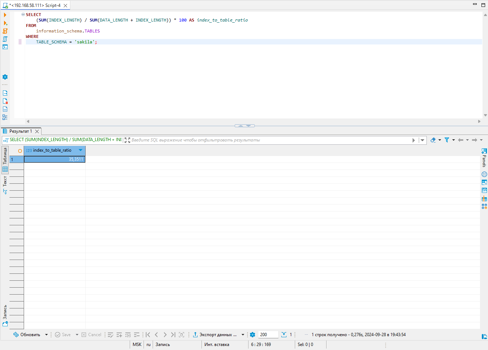
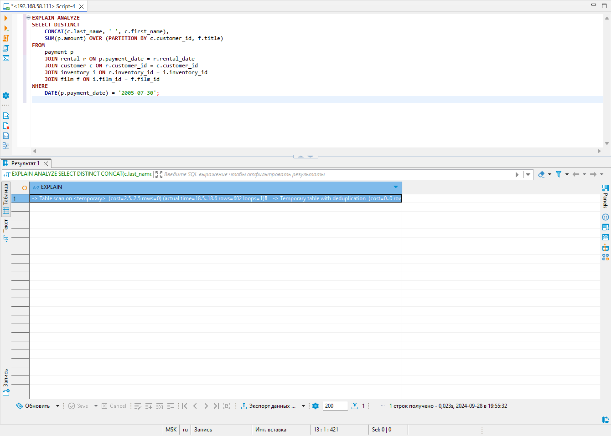
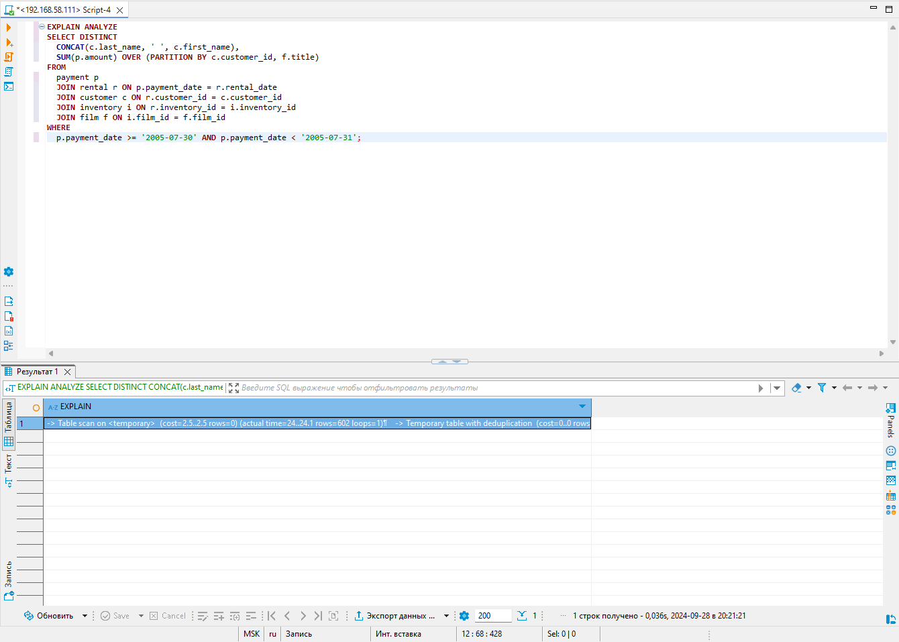

# Домашнее задание к занятию "`Индексы`" - `Дедюрин Денис`

---
## Задание 1
Напишите запрос к учебной базе данных, который вернёт процентное отношение общего размера всех индексов к общему размеру всех таблиц.

### Ответ:
```
SELECT
    (SUM(INDEX_LENGTH) / SUM(DATA_LENGTH + INDEX_LENGTH)) * 100 AS index_to_table_ratio
FROM
    information_schema.TABLES
WHERE
    TABLE_SCHEMA = 'sakila';
```


---
## Задание 2
Выполните explain analyze следующего запроса:

```
select distinct concat(c.last_name, ' ', c.first_name), sum(p.amount) over (partition by c.customer_id, f.title)
from payment p, rental r, customer c, inventory i, film f
where date(p.payment_date) = '2005-07-30' and p.payment_date = r.rental_date and r.customer_id = c.customer_id and i.inventory_id = r.inventory_id
```
- перечислите узкие места;
- оптимизируйте запрос: внесите корректировки по использованию операторов, при необходимости добавьте индексы.

### Ответ:
Выполняем **explain analyze** запроса:
```
EXPLAIN ANALYZE
select distinct concat(c.last_name, ' ', c.first_name), sum(p.amount) over (partition by c.customer_id, f.title)
from payment p, rental r, customer c, inventory i, film f
where date(p.payment_date) = '2005-07-30' and p.payment_date = r.rental_date and r.customer_id = c.customer_id and i.inventory_id = r.inventory_id;
```



**Запрос вернул:**
```
-> Table scan on <temporary>  (cost=2.5..2.5 rows=0) (actual time=14573..14573 rows=391 loops=1)
-> Temporary table with deduplication  (cost=0..0 rows=0) (actual time=14573..14573 rows=391 loops=1)
-> Window aggregate with buffering: sum(payment.amount) OVER (PARTITION BY c.customer_id,f.title )   (actual time=6482..14028 rows=642000 loops=1)
-> Sort: c.customer_id, f.title  (actual time=6482..6719 rows=642000 loops=1)
-> Stream results  (cost=22.8e+6 rows=17.1e+6) (actual time=0.639..4810 rows=642000 loops=1)
-> Nested loop inner join  (cost=22.8e+6 rows=17.1e+6) (actual time=0.631..3895 rows=642000 loops=1)
-> Nested loop inner join  (cost=21.1e+6 rows=17.1e+6) (actual time=0.626..3406 rows=642000 loops=1)
-> Nested loop inner join  (cost=19.3e+6 rows=17.1e+6) (actual time=0.619..2750 rows=642000 loops=1)
-> Inner hash join (no condition)  (cost=1.65e+6 rows=16.5e+6) (actual time=0.602..139 rows=634000 loops=1)
-> Filter: (cast(p.payment_date as date) = '2005-07-30')  (cost=1.72 rows=16500) (actual time=0.0465..12.4 rows=634 loops=1)
-> Table scan on p  (cost=1.72 rows=16500) (actual time=0.0317..8.27 rows=16044 loops=1)
-> Hash
-> Covering index scan on f using idx_title  (cost=103 rows=1000) (actual time=0.112..0.427 rows=1000 loops=1)
-> Covering index lookup on r using rental_date (rental_date=p.payment_date)  (cost=0.969 rows=1.04) (actual time=0.00256..0.00368 rows=1.01 loops=634000)
-> Single-row index lookup on c using PRIMARY (customer_id=r.customer_id)  (cost=250e-6 rows=1) (actual time=524e-6..591e-6 rows=1 loops=642000)
-> Single-row covering index lookup on i using PRIMARY (inventory_id=r.inventory_id)  (cost=250e-6 rows=1) (actual time=346e-6..418e-6 rows=1 loops=642000)
```

**Узкие места:**
**Функция DATE(p.payment_date):** Использование функции DATE на колонке payment_date препятствует использованию индексов, что приводит к полному сканированию таблицы payment.

**Nested Loop Joins:** Несколько вложенных циклов (Nested Loop Joins) могут быть очень дорогими, особенно если одна из таблиц значительно больше другой.

**Window Function:** Оконная функция SUM(p.amount) OVER (PARTITION BY c.customer_id, f.title) требует сортировки и агрегации большого объема данных, что приводит к значительным затратам времени.

**Временные таблицы и сортировка:** Создание временных таблиц и последующая сортировка данных также увеличивают время выполнения.


**Для оптимизации на мой взгляд можно выполнить следующее:**

**Добавим индексы:**
```
CREATE INDEX idx_payment_date ON payment(payment_date);
CREATE INDEX idx_rental_date ON rental(rental_date);
CREATE INDEX idx_customer_id ON customer(customer_id);
CREATE INDEX idx_inventory_id ON inventory(inventory_id);
CREATE INDEX idx_film_id ON film(film_id);
```


**Видоизменим сам запрос следующим образом:**
```
EXPLAIN ANALYZE
SELECT DISTINCT
  CONCAT(c.last_name, ' ', c.first_name),
  SUM(p.amount) OVER (PARTITION BY c.customer_id, f.title)
FROM
  payment p
  JOIN rental r ON p.payment_date = r.rental_date
  JOIN customer c ON r.customer_id = c.customer_id
  JOIN inventory i ON r.inventory_id = i.inventory_id
  JOIN film f ON i.film_id = f.film_id
WHERE
  p.payment_date >= '2005-07-30' AND p.payment_date < '2005-07-31';
```


```
-> Table scan on <temporary>  (cost=2.5..2.5 rows=0) (actual time=24..24.1 rows=602 loops=1)
-> Temporary table with deduplication  (cost=0..0 rows=0) (actual time=24..24 rows=602 loops=1)
-> Window aggregate with buffering: sum(payment.amount) OVER (PARTITION BY c.customer_id,f.title )   (actual time=19.9..23.5 rows=642 loops=1)
-> Sort: c.customer_id, f.title  (actual time=19.9..20.4 rows=642 loops=1)
-> Stream results  (cost=1032 rows=661) (actual time=0.0645..19.1 rows=642 loops=1)
-> Nested loop inner join  (cost=1032 rows=661) (actual time=0.0587..16.8 rows=642 loops=1)
-> Nested loop inner join  (cost=807 rows=661) (actual time=0.0526..14.9 rows=642 loops=1)
-> Nested loop inner join  (cost=582 rows=661) (actual time=0.047..12.4 rows=642 loops=1)
-> Nested loop inner join  (cost=351 rows=634) (actual time=0.0302..3.63 rows=634 loops=1)
-> Filter: ((r.rental_date >= TIMESTAMP'2005-07-30 00:00:00') and (r.rental_date < TIMESTAMP'2005-07-31 00:00:00'))  (cost=129 rows=634) (actual time=0.0195..1.48 rows=634 loops=1)
-> Covering index range scan on r using rental_date over ('2005-07-30 00:00:00' <= rental_date < '2005-07-31 00:00:00')  (cost=129 rows=634) (actual time=0.017..0.656 rows=634 loops=1)
-> Single-row index lookup on c using PRIMARY (customer_id=r.customer_id)  (cost=0.25 rows=1) (actual time=0.00295..0.003 rows=1 loops=634)
-> Index lookup on p using idx_payment_date (payment_date=r.rental_date)  (cost=0.261 rows=1.04) (actual time=0.0119..0.0135 rows=1.01 loops=634)
-> Single-row index lookup on i using PRIMARY (inventory_id=r.inventory_id)  (cost=0.24 rows=1) (actual time=0.0034..0.00345 rows=1 loops=642)
-> Single-row index lookup on f using PRIMARY (film_id=i.film_id)  (cost=0.24 rows=1) (actual time=0.00253..0.00258 rows=1 loops=642)
```


---
## Задание 3
Самостоятельно изучите, какие типы индексов используются в PostgreSQL. Перечислите те индексы, которые используются в PostgreSQL, а в MySQL — нет.

Приведите ответ в свободной форме.

### Ответ:


