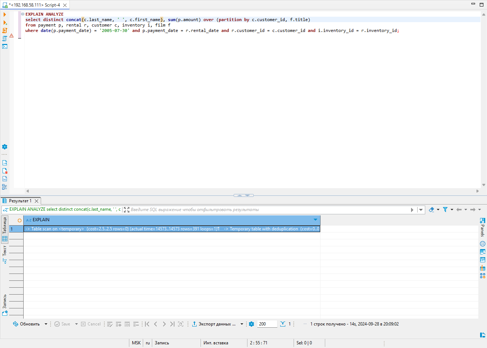
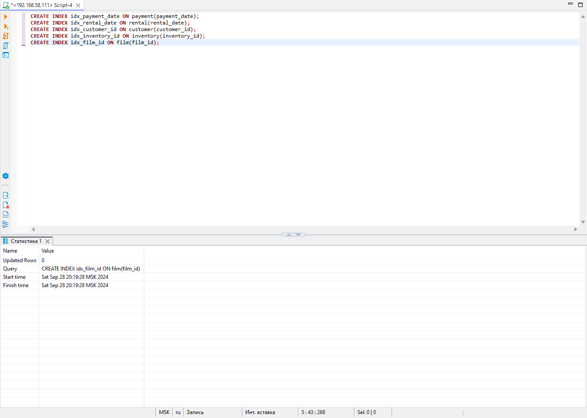

# Домашнее задание к занятию "`Индексы`" - `Дедюрин Денис`

---
## Задание 1
Напишите запрос к учебной базе данных, который вернёт процентное отношение общего размера всех индексов к общему размеру всех таблиц.

### Ответ:
```
SELECT
    (SUM(INDEX_LENGTH) / SUM(DATA_LENGTH + INDEX_LENGTH)) * 100 AS index_to_table_ratio
FROM
    information_schema.TABLES
WHERE
    TABLE_SCHEMA = 'sakila';
```


---
## Задание 2
Выполните explain analyze следующего запроса:

```
select distinct concat(c.last_name, ' ', c.first_name), sum(p.amount) over (partition by c.customer_id, f.title)
from payment p, rental r, customer c, inventory i, film f
where date(p.payment_date) = '2005-07-30' and p.payment_date = r.rental_date and r.customer_id = c.customer_id and i.inventory_id = r.inventory_id
```
- перечислите узкие места;
- оптимизируйте запрос: внесите корректировки по использованию операторов, при необходимости добавьте индексы.

### Ответ:
Выполняем **explain analyze** запроса:
```
EXPLAIN ANALYZE
SELECT DISTINCT 
    CONCAT(c.last_name, ' ', c.first_name), 
    SUM(p.amount) OVER (PARTITION BY c.customer_id, f.title)
FROM 
    payment p
    JOIN rental r ON p.payment_date = r.rental_date
    JOIN customer c ON r.customer_id = c.customer_id
    JOIN inventory i ON r.inventory_id = i.inventory_id
    JOIN film f ON i.film_id = f.film_id
WHERE 
    DATE(p.payment_date) = '2005-07-30';
```



**Запрос вернул:**
```
-> Table scan on <temporary>  (cost=2.5..2.5 rows=0) (actual time=246..246 rows=602 loops=1)
-> Temporary table with deduplication  (cost=0..0 rows=0) (actual time=246..246 rows=602 loops=1)
-> Window aggregate with buffering: sum(payment.amount) OVER (PARTITION BY c.customer_id,f.title )   (actual time=235..244 rows=642 loops=1)
-> Sort: c.customer_id, f.title  (actual time=235..235 rows=642 loops=1)
-> Stream results  (cost=76498 rows=17132) (actual time=111..234 rows=642 loops=1)
-> Nested loop inner join  (cost=76498 rows=17132) (actual time=111..233 rows=642 loops=1)
-> Nested loop inner join  (cost=57652 rows=17132) (actual time=104..209 rows=642 loops=1)
-> Nested loop inner join  (cost=38807 rows=17132) (actual time=78.7..168 rows=642 loops=1)
-> Nested loop inner join  (cost=19961 rows=17132) (actual time=42.5..128 rows=642 loops=1)
-> Filter: (cast(p.payment_date as date) = '2005-07-30')  (cost=1747 rows=16500) (actual time=30.4..111 rows=634 loops=1)
-> Table scan on p  (cost=1747 rows=16500) (actual time=30.4..106 rows=16044 loops=1)
-> Covering index lookup on r using rental_date (rental_date=p.payment_date)  (cost=1 rows=1.04) (actual time=0.0241..0.0254 rows=1.01 loops=634)
-> Single-row index lookup on c using PRIMARY (customer_id=r.customer_id)  (cost=1 rows=1) (actual time=0.0626..0.0627 rows=1 loops=642)
-> Single-row index lookup on i using PRIMARY (inventory_id=r.inventory_id)  (cost=1 rows=1) (actual time=0.0625..0.0625 rows=1 loops=642)
-> Single-row index lookup on f using PRIMARY (film_id=i.film_id)  (cost=1 rows=1) (actual time=0.0368..0.0368 rows=1 loops=642)
```

**Возможные узкие места:**

Фильтрация по дате с использованием функции CAST():

Узкое место: использование CAST(p.payment_date AS date) приводит к тому, что индексы на payment_date не используются эффективно.
Временная таблица для удаления дубликатов:

Создание временной таблицы для удаления дубликатов может быть дорогостоящей операцией.
Буферизация оконного агрегата:

Оконная функция SUM() требует буферизации, что может быть дорогостоящим для больших наборов данных.
Использование вложенных циклов (Nested Loop Joins):

Вложенные циклы могут быть неэффективными для больших таблиц, особенно если они не оптимизированы с индексами.


**Для оптимизации на мой взгляд можно выполнить следующее:**

**Использование индексов:** Добавление индексов на ключи, используемые в условиях соединения и фильтрации.

**Оптимизация фильтрации по дате:** Избежать использования функции DATE, чтобы позволить использование индексов.

**Добавим индексы:**
```
CREATE INDEX idx_payment_date ON payment(payment_date);
CREATE INDEX idx_rental_date ON rental(rental_date);
CREATE INDEX idx_rental_customer ON rental(customer_id);
CREATE INDEX idx_inventory_id ON inventory(inventory_id);
CREATE INDEX idx_film_id ON film(film_id);
```

**Видоизменим сам запрос следующим образом:**
```
EXPLAIN ANALYZE
SELECT DISTINCT 
    CONCAT(c.last_name, ' ', c.first_name) AS customer_name, 
    SUM(p.amount) OVER (PARTITION BY c.customer_id, f.title) AS total_amount
FROM 
    payment p
    JOIN rental r ON p.payment_date = r.rental_date
    JOIN customer c ON r.customer_id = c.customer_id
    JOIN inventory i ON r.inventory_id = i.inventory_id
    JOIN film f ON i.film_id = f.film_id
WHERE 
    p.payment_date BETWEEN '2005-07-30 00:00:00' AND '2005-07-30 23:59:59';
```

---
## Задание 3
Самостоятельно изучите, какие типы индексов используются в PostgreSQL. Перечислите те индексы, которые используются в PostgreSQL, а в MySQL — нет.

Приведите ответ в свободной форме.

### Ответ:


